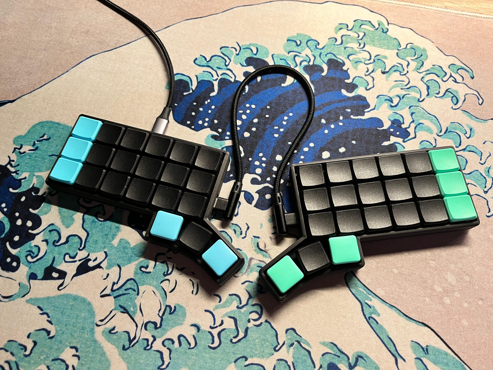
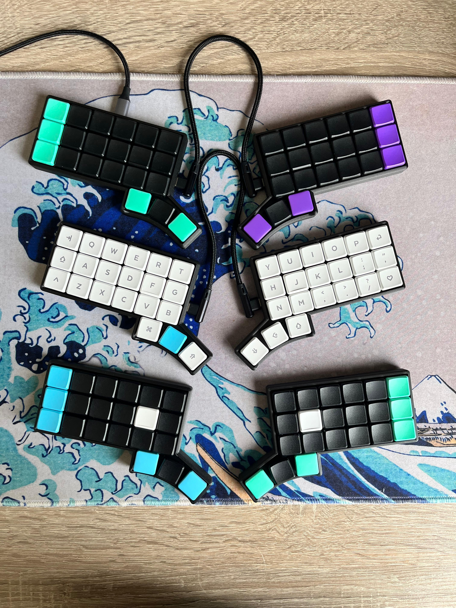
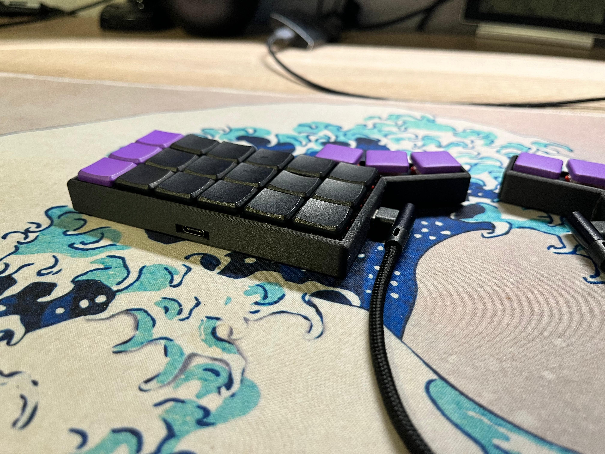
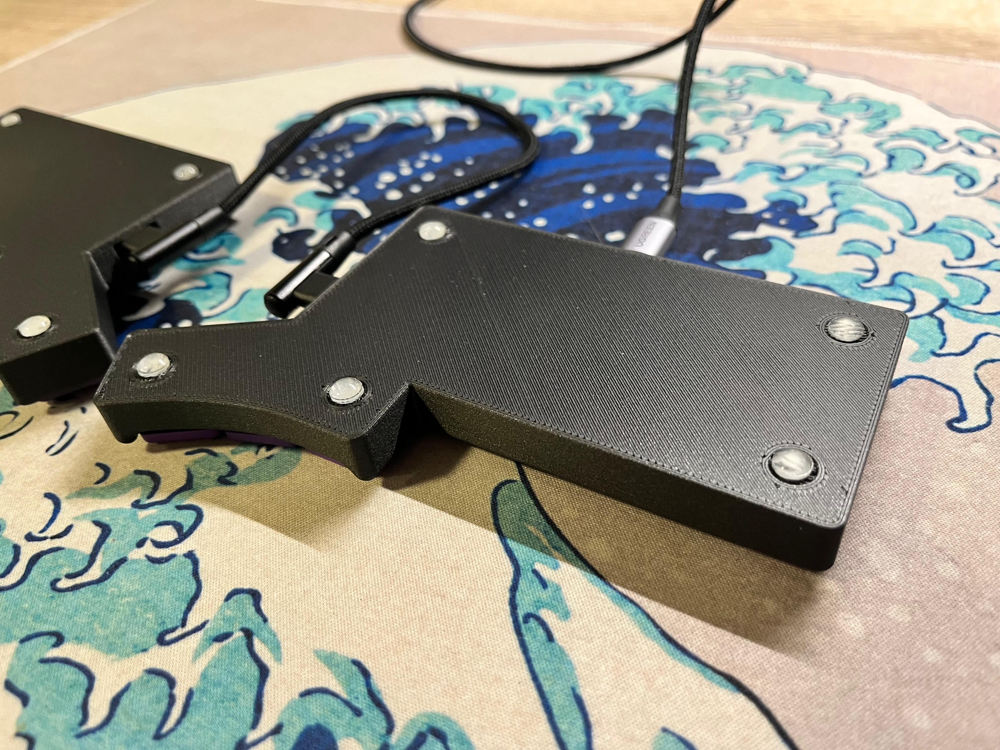
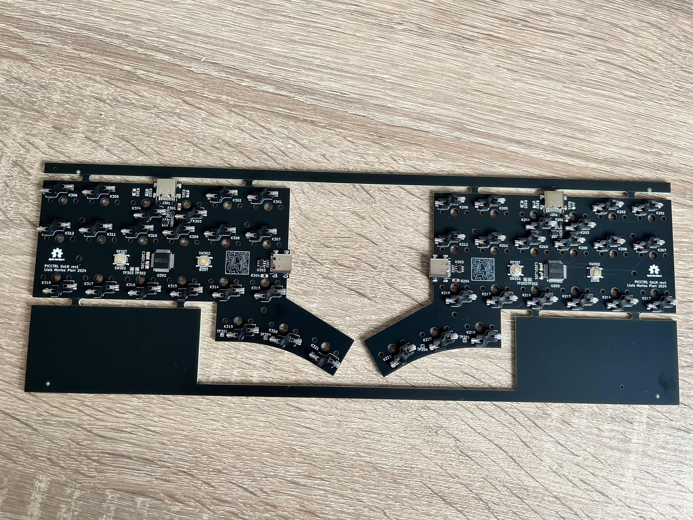

# PICCTRL - 0xLM
## 3x6 + 3 Split Ortholinear Keyboard with on board MCU

## Why?
I wanted to make a compact keyboard by using the minimum surface for the keys with all the components underneath them while no increasing the height of the overall keyboard.

## Characteristics:
* CH559L [FAK](https://github.com/semickolon/fak) powered.
* Direct pin with ESD and over-current protection [[Schematic]](https://github.com/llmerlos/0xLM/blob/main/PCB/pdf/Board.pdf).
* [3D Printed Case](https://github.com/llmerlos/0xLM/tree/main/CASE).
* PCBA ready* (See Known Issues). 
* Choc V1 spacing.

## Pics

## Known Issues:
* USB part is a little bit missplaced and requires triming the legs (for a fee in JLCPCB).
* USB part is for 0.8mm PCB instead of 1.6mm PCB.
* BOOT silkscreen rotated 180 degrees on the right PCB.